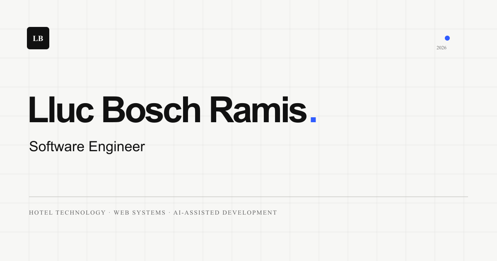

<p align="center">
  <a href="https://llucbosch.com" aria-label="Abrir el portfolio de Lluc Bosch Ramis">
    
  </a>
</p>

<p align="center">
  <a href="https://llucbosch.com"><strong>Ver portfolio</strong></a>
  ·
  <a href="https://www.linkedin.com/in/lluc-bosch-ramis-80959b213/">LinkedIn</a>
  ·
  <a href="mailto:lluc.bosch@gmail.com">Contacto</a>
</p>

<p align="center">
  <a href="https://github.com/lluc898/portfolio/actions/workflows/ci.yml"></a>
  
  
  
</p>

# Portfolio de Lluc Bosch Ramis

Portfolio profesional de **Lluc Bosch Ramis**, Software Engineer especializado en desarrollo web, tecnología hotelera y flujos de ingeniería asistidos por IA.

La web presenta experiencia profesional, proyectos, stack técnico y forma de trabajo con una interfaz sobria, rápida y accesible. Está construida como sitio estático con Astro y publicada en [llucbosch.com](https://llucbosch.com).

## Características

- Contenido orientado a recruiters y equipos de ingeniería.
- Experiencia profesional explicada mediante áreas de contribución y casos concretos.
- CV profesional en PDF, descargable desde el hero y la sección de contacto.
- Arquitectura estática, sin JavaScript de aplicación innecesario.
- Diseño responsive con tema claro y oscuro.
- Navegación por teclado, foco visible y soporte para `prefers-reduced-motion`.
- Validación automática del HTML y de reglas de accesibilidad sobre el build generado.
- Pruebas E2E de los recorridos principales en escritorio y móvil.
- Presupuestos Lighthouse para rendimiento, accesibilidad, buenas prácticas y SEO.
- SEO técnico con canonical, Open Graph, Twitter Cards, sitemap y datos estructurados.
- Página 404 propia y configuración de producción con Nginx y Docker Compose.
- Validación automática de tipos y build en cada push y pull request.

## Proyectos destacados

### Neon Led Spain

E-commerce de neones LED personalizados con catálogo, configurador visual, precio en vivo, carrito, solicitudes a medida y panel administrativo.

El caso de estudio del portfolio explica el problema del producto, la solución y varias decisiones técnicas, entre ellas el recálculo del precio en servidor y el despliegue self-hosted.

- [Ver caso de estudio](https://llucbosch.com/#proyectos)
- [Abrir demo](https://neonledspain.llucbosch.com/)
- [Consultar código](https://github.com/lluc898/neonweb)

### Futmondo Telegram Bot

Proyecto personal en Python y Flask que conecta una liga real de Futmondo con Telegram para consultar mercado y finanzas, gestionar pujas mediante botones y recibir resúmenes programados.

El caso muestra el impacto sin atribuir métricas no medidas y aporta evidencia pública de integración de APIs, webhooks protegidos, procesos programados, pruebas automatizadas y despliegue con Docker.

- [Ver caso de estudio](https://llucbosch.com/#futmondo-bot)
- [Consultar código y capturas](https://github.com/lluc898/futmondojobs)
- [Revisar CI](https://github.com/lluc898/futmondojobs/actions/workflows/ci.yml)

La sección de proyectos incluye también un caso profesional anonimizado sobre sincronización de datos entre proveedores hoteleros, descrito como un flujo `Pull → Transform → Push` sin exponer información interna.

## Stack

| Área | Tecnología |
| --- | --- |
| Framework | [Astro](https://astro.build/) |
| Lenguaje | [TypeScript](https://www.typescriptlang.org/) |
| Estilos | [Tailwind CSS](https://tailwindcss.com/) + CSS |
| Tipografía | Inter Variable + JetBrains Mono Variable |
| Producción | Nginx + Docker Compose |
| Calidad | Astro Check + GitHub Actions |

## Desarrollo local

Necesitas Node.js `>=24.8.0` y npm `>=9.6.5`.

```bash
git clone https://github.com/lluc898/portfolio.git
cd portfolio
npm ci
npm run dev
```

El servidor de desarrollo estará disponible en `http://localhost:4321`.

## Comandos

| Comando | Acción |
| --- | --- |
| `npm run dev` | Inicia el entorno de desarrollo |
| `npm run check` | Comprueba Astro y TypeScript |
| `npm run build` | Genera la versión de producción en `dist/` |
| `npm run check:a11y` | Valida el HTML generado y sus reglas de accesibilidad |
| `npm run check:lighthouse` | Aplica presupuestos de calidad y rendimiento con Lighthouse |
| `npm run check:seo` | Valida metadatos, tarjetas sociales, JSON-LD, sitemap y robots |
| `npm run check:links` | Comprueba enlaces internos, recursos, CTA y destinos esenciales |
| `npm run test:e2e` | Compila y prueba los recorridos principales en Chromium |
| `npm run preview` | Sirve el build localmente |

## Despliegue

Cada push a `main` ejecuta primero las comprobaciones y el build en GitHub Actions. Si terminan correctamente, un runner autoservido en el servidor genera una release, actualiza el enlace `current`, recrea el contenedor de Nginx y espera a que su healthcheck confirme el despliegue. Si la nueva release no queda saludable, el script restaura automáticamente la anterior.

La publicación se realiza en `/home/lluc/apps/portfolio` mediante [`deploy/deploy.sh`](./deploy/deploy.sh). Las releases anteriores se conservan para facilitar una recuperación manual.

## Estructura

```text
src/
├── components/   Componentes reutilizables
├── layouts/      Layout, metadatos y datos estructurados
├── pages/        Homepage y página 404
└── styles/       Sistema visual global

public/           Favicon, robots e imagen social
cv/               Fuente HTML del CV profesional
deploy/           Configuración de Nginx y Docker Compose
scripts/          Validaciones y servidor estático para pruebas
tests/e2e/        Recorridos de recruiter en escritorio y móvil
```

Las decisiones de producto y diseño están documentadas en [CODEX.md](./CODEX.md) y [DESIGN.md](./DESIGN.md).

## Contacto

- Web: [llucbosch.com](https://llucbosch.com)
- LinkedIn: [Lluc Bosch Ramis](https://www.linkedin.com/in/lluc-bosch-ramis-80959b213/)
- Email: [lluc.bosch@gmail.com](mailto:lluc.bosch@gmail.com)
